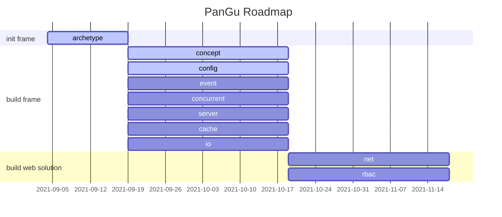

# PanGu 盘古

> The name comes from the creator of universe in ancient chinese mythology.<br/>
> 以中国古代神话中创世神命名

## What PanGu Is? 盘古是什么？

* [x] A Normal form of framework code. 框架代码范式。
* [x] A general solution for building website applications. 构建网站应用的通用解决方案。
* [x] Meeting the core challenges of building high-performance websites. 应对构建高性能网站的核心挑战。
* [x] Solid and less dependent framework code. 坚实少依赖的框架代码。
* [x] Enhancements based on springboot. 基于springboot进行增强。
* [x] Out of the box and easy to use. 开箱即用且易于使用。
* [x] Convenient for secondary development and expansion. 便于二次开发与扩展。
* [x] Exploration of reactive programing and coroutines. 对响应式与协程的探索。

## Structure

```text
.
├─pangu-common (base code 基础代码)
├─pangu-core (frame code 框架代码)
├─pangu-web (web code 网站基础代码)
├─pangu-spring-boot-starter (starter for pangu 盘古starter)
├─pangu-ready-spring-boot-starter (starter for pangu and more enhancements 封装盘古与更多增强starter)
└─pangu-test (integrated test code 集成测试代码)
```

## Getting Started

## Roadmap



## LICENSE

## Maintainers

[](mailto:yuebaix@outlook.com)

## Changelog
